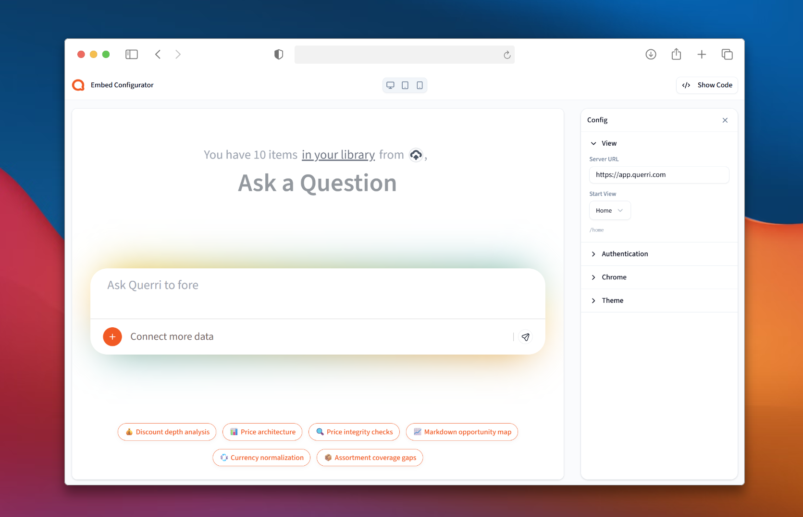
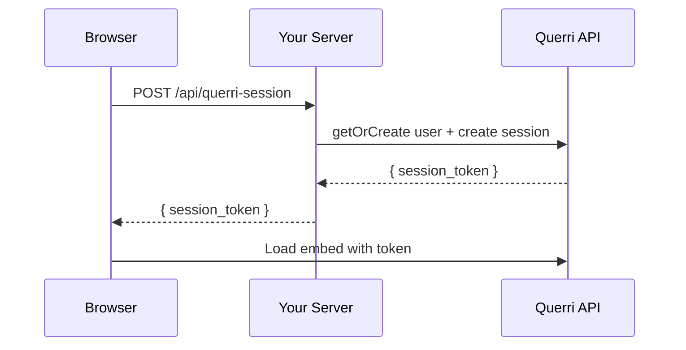

# @querri-inc/embed

> Embed Querri analytics in your app. Zero dependencies. Works everywhere.

**React** | **Vue** | **Svelte** | **Angular** | **Vanilla JS** | **CDN**



Querri Embed drops a full analytics experience into your app — dashboards, reports, and data exploration — with built-in authentication, per-user access control, UI customization, and theming. One component, one server endpoint, zero dependencies.

## Get Started in 60 Seconds

### 1. Install

```bash
npm install @querri-inc/embed
```

### 2. Add the embed

```tsx
import { QuerriEmbed } from '@querri-inc/embed/react';

<QuerriEmbed
  style={{ width: '100%', height: '600px' }}
  serverUrl="https://app.querri.com"
  auth={{ sessionEndpoint: '/api/querri-session' }}
/>
```

> Using Vue, Svelte, Angular, or Vanilla JS? See [Framework Examples](#framework-examples) below.

> The `auth` prop supports multiple modes: server tokens, share keys, and popup login. See [Authentication Modes](#authentication-modes) for all options.

### 3. Create a session endpoint

> Only needed for server-token auth (`sessionEndpoint` or `fetchSessionToken`). Skip this step if using [Share Key](#share-key-public-embeds) or [Popup Login](#popup-login-user-accounts).

```typescript
// app/api/querri-session/route.ts
import { createSessionHandler } from '@querri-inc/embed/server/nextjs';

export const POST = createSessionHandler();
```

Set `QUERRI_API_KEY` and `QUERRI_ORG_ID` [environment variables](#environment-variables).

> `createSessionHandler()` creates an anonymous session. To map sessions to your authenticated users, use [`resolveParams`](#quick-start) in the Server SDK section.

> Using a different framework? See the [Server SDK](#server-sdk) section for all framework handlers.

### 4. Done.

The embed handles auth, token caching, and cleanup automatically.



## Framework Examples

**React**

```tsx
import { QuerriEmbed } from '@querri-inc/embed/react';

<QuerriEmbed
  style={{ width: '100%', height: '600px' }}
  serverUrl="https://app.querri.com"
  auth={auth}
  startView="/builder/dashboard/uuid"
/>
```

**Vue**

```vue
<template>
  <div style="width: 100%; height: 600px">
    <QuerriEmbed server-url="https://app.querri.com" :auth="auth" start-view="/builder/dashboard/uuid" />
  </div>
</template>
<script setup>
import { QuerriEmbed } from '@querri-inc/embed/vue';
const auth = { shareKey: 'your-share-key', org: 'your-org-id' };
</script>
```

**Svelte**

```svelte
<script>
  import QuerriEmbed from '@querri-inc/embed/svelte';
  const auth = { shareKey: 'your-share-key', org: 'your-org-id' };
</script>
<div style="width: 100%; height: 600px">
  <QuerriEmbed serverUrl="https://app.querri.com" {auth} startView="/builder/dashboard/uuid" />
</div>
```

**Angular**

```typescript
import { Component } from '@angular/core';
import { QuerriEmbedComponent } from '@querri-inc/embed/angular';

@Component({
  standalone: true,
  imports: [QuerriEmbedComponent],
  template: `<div style="width: 100%; height: 600px">
    <querri-embed [serverUrl]="'https://app.querri.com'" [auth]="auth" [startView]="'/builder/dashboard/uuid'" />
  </div>`,
})
export class DashboardComponent {
  auth = { shareKey: 'your-share-key', org: 'your-org-id' };
}
```

**Vanilla JS**

```javascript
import { QuerriEmbed } from '@querri-inc/embed';

QuerriEmbed.create('#container', {
  serverUrl: 'https://app.querri.com',
  auth: { shareKey: 'your-share-key', org: 'your-org-id' },
  startView: '/builder/dashboard/uuid',
});
```

**CDN**

```html
<script src="https://unpkg.com/@querri-inc/embed/dist/core/querri-embed.iife.global.js"></script>
<script>
  QuerriEmbed.create('#container', {
    serverUrl: 'https://app.querri.com',
    auth: { shareKey: 'your-share-key', org: 'your-org-id' },
  });
</script>
```

## Authentication Modes

### Share Key (Public Embeds)

For publicly shared dashboards. No user login required.

```javascript
auth: {
  shareKey: 'abc123',  // From your dashboard's share link
  org: 'org_456',      // Your organization ID
}
```

### Server Token (Enterprise)

Your backend exchanges an API key for a session token. Point the embed at your session endpoint:

```javascript
auth: {
  sessionEndpoint: '/api/querri-session',
}
```

The SDK POSTs to this URL and extracts `session_token` from the JSON response automatically (with retry).

For full control over the request, use a callback instead:

```javascript
auth: {
  fetchSessionToken: async () => {
    const res = await fetch('/api/querri-session');
    const { session_token } = await res.json();
    return session_token;
  },
}
```

### Popup Login (User Accounts)

Users authenticate via a popup window. Session tokens are cached in localStorage.

```javascript
auth: 'login'
```

## Options

| Option | Type | Required | Description |
|--------|------|----------|-------------|
| `serverUrl` | `string` | Yes | Querri server URL. Use `'https://app.querri.com'` for web-app embeds or `'https://app.querri.com/builder'` for dashboard embeds. |
| `auth` | `QuerriAuth` | Yes | Authentication mode (see above) |
| `startView` | `string` | No | Initial view path (e.g. `'/builder/dashboard/uuid'`). Defaults to `'/home'` |
| `chrome` | `object` | No | UI chrome visibility |
| `chrome.sidebar` | `{ show?: boolean }` | No | Sidebar visibility (default: hidden) |
| `chrome.header` | `{ show?: boolean }` | No | Header visibility (default: shown) |
| `theme` | `object` | No | Theme overrides |
| `timeout` | `number` | No | Max time (ms) to wait for iframe to respond (default: `15000`) |

## Events

| Event | Payload | Description |
|-------|---------|-------------|
| `ready` | `{}` | Embed authenticated and ready |
| `error` | `{ code, message }` | An error occurred |
| `session-expired` | `{}` | Session token expired |
| `navigation` | `{ type, path?, ... }` | User navigated within the embed |

```javascript
// Example: handling events
instance.on('error', ({ code, message }) => {
  console.error(`Querri error [${code}]: ${message}`);
});

instance.on('navigation', ({ type, path }) => {
  console.log('Navigated to:', path);
});
```

### Error Codes

| Code | Meaning |
|------|---------|
| `invalid_auth` | Auth config is invalid |
| `token_fetch_failed` | `fetchSessionToken` callback failed after 3 automatic retries |
| `popup_blocked` | Browser blocked the login popup |
| `auth_failed` | Authentication failed after popup login |
| `auth_required` | Auth required but no login mode configured |
| `timeout` | Iframe didn't respond within timeout period (default: 15s, configurable via `timeout` option) |

## Instance API

```javascript
const querri = QuerriEmbed.create('#container', options);

querri.on('ready', callback);     // Subscribe to event (chainable)
querri.off('ready', callback);    // Unsubscribe (chainable)
querri.destroy();                 // Clean up iframe and listeners

querri.ready;    // boolean -- true when authenticated
querri.iframe;   // HTMLIFrameElement | null

QuerriEmbed.version;  // SDK version string (e.g. '0.1.0')
```

## Framework Component API

### React

The React component accepts all SDK options as props, plus:

| Prop | Type | Description |
|------|------|-------------|
| `className` | `string` | CSS class for the container div |
| `style` | `CSSProperties` | Inline styles for the container div |
| `onReady` | `() => void` | Ready callback |
| `onError` | `(err) => void` | Error callback |
| `onSessionExpired` | `() => void` | Session expired callback |
| `onNavigation` | `(data) => void` | Navigation callback |

Access the underlying instance via ref:

```tsx
import { useRef } from 'react';
import { QuerriEmbed, type QuerriEmbedRef } from '@querri-inc/embed/react';

const ref = useRef<QuerriEmbedRef>(null);
// ref.current.instance -- SDK instance
// ref.current.iframe -- iframe element
<QuerriEmbed ref={ref} ... />
```

### Vue

Events: `@ready`, `@error`, `@session-expired`, `@navigation`

Access the underlying instance via template ref:

```vue
<QuerriEmbed ref="embedRef" ... />
<!-- embedRef.instance / embedRef.iframe -->
```

### Svelte

Events: `on:ready`, `on:error`, `on:session-expired`, `on:navigation`

Access the underlying instance via `bind:this`:

```svelte
<QuerriEmbed bind:this={embed} ... />
<!-- embed.getInstance() / embed.getIframe() -->
```

### Angular

Inputs: `serverUrl`, `auth`, `startView`, `chrome`, `theme`

Events: `(ready)`, `(error)`, `(sessionExpired)`, `(navigation)`

Access the underlying instance via a template ref or `ViewChild`:

```typescript
@ViewChild(QuerriEmbedComponent) embed!: QuerriEmbedComponent;
// embed.sdkInstance -- SDK instance
// embed.iframe -- iframe element
```

## Server SDK

The server SDK is included in `@querri-inc/embed` -- no extra package required. Use it to create embed session tokens, manage users, enforce access policies, and interact with the full Querri API from your backend. Most apps only need a one-liner session handler.

### Quick Start

Import `createSessionHandler` from your framework's sub-path and export a route handler:

```typescript
// Next.js -- app/api/querri-session/route.ts
import { createSessionHandler } from '@querri-inc/embed/server/nextjs';
export const POST = createSessionHandler();

// SvelteKit -- src/routes/api/querri-session/+server.ts
import { createSessionHandler } from '@querri-inc/embed/server/sveltekit';
export const POST = createSessionHandler();

// React Router v7 -- app/routes/api.querri-session.ts
import { createSessionHandler } from '@querri-inc/embed/server/react-router';
export const action = createSessionHandler();

// Nuxt -- server/api/querri-session.post.ts
import { createSessionHandler } from '@querri-inc/embed/server/nuxt';
export default createSessionHandler();

// Express -- server.ts
import { createSessionHandler } from '@querri-inc/embed/server/express';
app.post('/api/querri-session', createSessionHandler());
```

Pass a `resolveParams` callback to extract user identity from your auth system instead of reading the request body directly:

```typescript
// Next.js -- app/api/querri-session/route.ts
import { createSessionHandler } from '@querri-inc/embed/server/nextjs';
import { getServerSession } from 'next-auth';

export const POST = createSessionHandler({
  resolveParams: async (req) => {
    const session = await getServerSession();
    return {
      user: { external_id: session!.user!.id, email: session!.user!.email! },
      access: { sources: ['src_sales'], filters: { tenant_id: session!.user!.orgId } },
    };
  },
});
```

If you omit `resolveParams`, the handler creates an anonymous session.

> **Security:** Always derive user identity and access from your server-side auth system. Never read `user` or `access` from the request body — a malicious client can impersonate any user or escalate access.

### Environment Variables

| Variable | Description | Default |
|---|---|---|
| `QUERRI_API_KEY` | API key (`qk_*` format) | -- |
| `QUERRI_ORG_ID` | Organization / tenant ID | -- |
| `QUERRI_URL` | API host URL | `https://app.querri.com` |

### Manual Setup

For custom servers or advanced use cases where you need the full Querri client API:

```typescript
import { Querri } from '@querri-inc/embed/server';

const client = new Querri('qk_your_api_key');

const { session_token, expires_in } = await client.getSession({
  user: {
    external_id: 'usr_alice',
    email: 'alice@example.com',
  },
  access: {
    sources: ['src_sales'],
    filters: { tenant_id: 'acme' },
  },
  ttl: 3600,
  origin: 'https://myapp.com',
});
```

### Available Resources

The client exposes these resource namespaces: `users`, `embed`, `policies`, `projects`, `chats`, `dashboards`, `data`, `files`, `sources`, `keys`, `sharing`, `audit`, `usage`.

### Full Reference

See **[docs/server-sdk.md](docs/server-sdk.md)** for complete API documentation, including every method signature, pagination, streaming, error handling, and detailed framework integration guides.

## Troubleshooting

### Embed is blank or has zero height

Your container needs explicit dimensions. Add `style="width: 100%; height: 600px"` to the container element.

### "Missing API key" error

Set the `QUERRI_API_KEY` environment variable. Find your API key at https://app.querri.com/settings/api-keys.

### `timeout` -- iframe didn't respond

Check that `serverUrl` is correct and the Querri server is reachable. The default timeout is 15 seconds. You can increase it for slow networks:

```javascript
QuerriEmbed.create('#container', {
  serverUrl: 'https://app.querri.com',
  auth: { /* ... */ },
  timeout: 30000, // 30 seconds
});
```

### `popup_blocked`

The login popup requires a user gesture (e.g., a button click). Browsers block popups triggered without user interaction.

### `token_fetch_failed`

Your `fetchSessionToken` callback (or `sessionEndpoint` fetch) failed after 3 automatic retries (1s, 2s backoff). Verify that your server endpoint returns `{ session_token: "..." }` as JSON and is reachable.

## TypeScript

All types are exported from every entry point:

```typescript
import type {
  QuerriAuth,
  QuerriShareKeyAuth,
  QuerriTokenAuth,
  QuerriSessionEndpointAuth,
  QuerriChromeConfig,
  QuerriEmbedOptions,
  QuerriInstance,
  QuerriEventType,
  QuerriEventCallback,
  QuerriErrorEvent,
  QuerriNavigationEvent,
} from '@querri-inc/embed';

// Framework wrappers re-export all core types, plus their own:
import type { QuerriEmbedProps, QuerriEmbedRef } from '@querri-inc/embed/react';
```

## Requirements

The core SDK has **zero dependencies** and works in any modern browser.

Framework wrappers require:

| Framework | Minimum Version |
|-----------|----------------|
| React | >= 17 |
| Vue | >= 3.2 |
| Svelte | >= 4 |
| Angular | >= 17 |

All framework dependencies are optional -- install only what you use.

## Important Notes

- **React/Vue/Angular:** Memoize the `auth` prop if it's an object. A new object reference on every render/change detection cycle will cause the iframe to be destroyed and recreated.
- All framework wrappers automatically clean up the iframe on unmount.

## License

MIT
