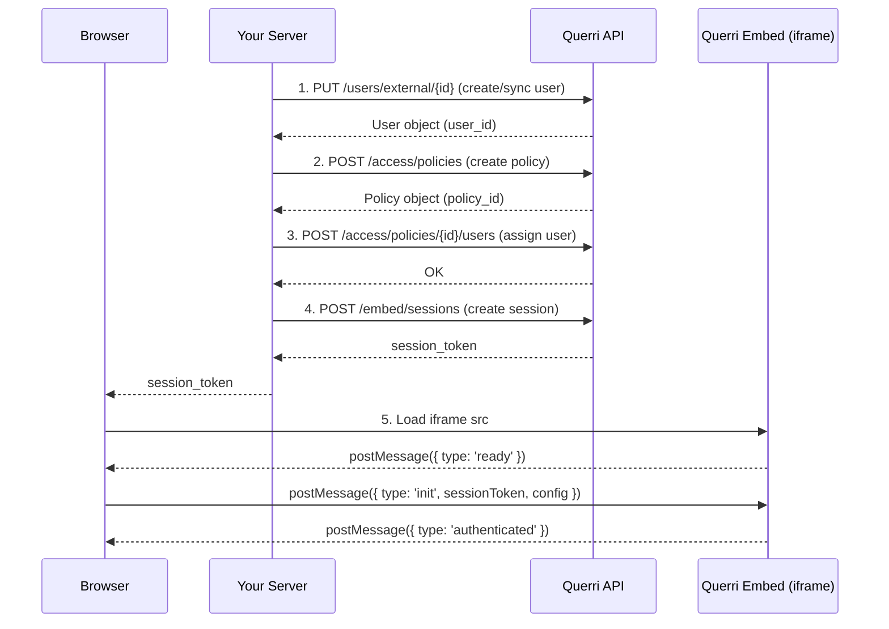
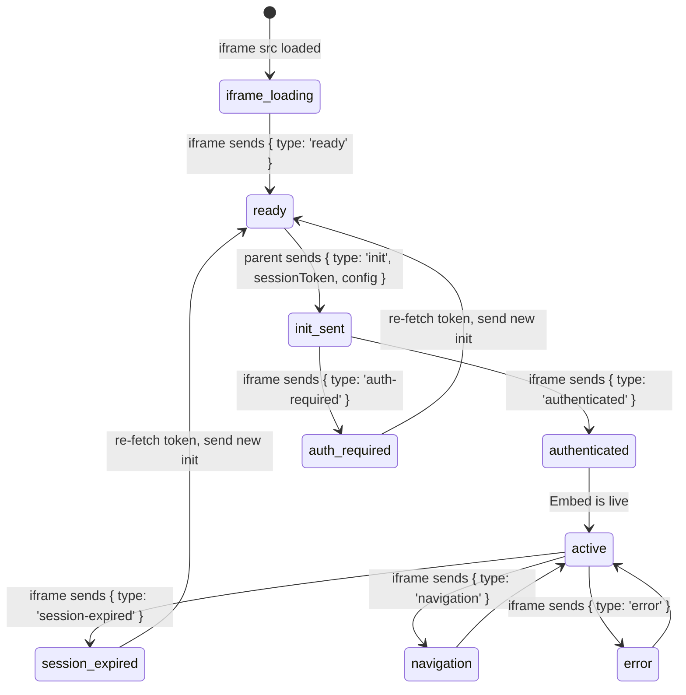

# Querri Embed API Integration Guide

This guide walks you through integrating Querri Embed using raw HTTP API calls — no SDK required. It covers the complete flow from authentication to rendering an embedded analytics iframe in your application.

Use this guide if you are building in a language without an SDK (Go, Python, Ruby, etc.) or if you want to understand exactly what the SDK does under the hood. If you are using Node.js, see the [Server SDK Reference](./server-sdk.md) instead.

## Prerequisites

- A Querri account with an API key (`qk_*` format)
- Your organization ID
- At least one data source configured in Querri
- A web application with a server-side component

---

## Architecture Overview

Embedding Querri involves two sides: your **server** (which talks to the Querri API) and your **frontend** (which loads an iframe and communicates with it via `postMessage`).



### Security Model

- Your **API key never leaves your server**. All API calls happen server-side.
- The **session token** is short-lived (default 1 hour), scoped to a single user, and optionally locked to a specific origin domain.
- The iframe validates the session token server-side before rendering any content.
- All `postMessage` communication is origin-validated on both sides.

---

## Authentication

Every API request requires these headers:

```
POST /api/v1/{resource}
Host: app.querri.com

Authorization: Bearer qk_your_api_key
X-Tenant-ID: your_org_id
Content-Type: application/json
Accept: application/json
```

| Header | Required | Description |
|--------|----------|-------------|
| `Authorization` | Yes | Your API key in `Bearer qk_*` format |
| `X-Tenant-ID` | Yes | Your organization ID |
| `Content-Type` | Yes (for POST/PUT/PATCH) | Always `application/json` |
| `Accept` | Recommended | `application/json` |

**Base URL**: `https://app.querri.com/api/v1`

Verify your credentials with a simple request:

```bash
curl https://app.querri.com/api/v1/users?limit=1 \
  -H "Authorization: Bearer qk_your_api_key" \
  -H "X-Tenant-ID: your_org_id" \
  -H "Accept: application/json"
```

A `200` response confirms your API key and org ID are valid.

---

## Step 1: Create or Sync a User

Before creating an embed session, you need a Querri user that maps to your application's user. The recommended approach is a **get-or-create by external ID** — if the user exists it returns them unchanged, if not it creates them.

### Request

```
PUT /api/v1/users/external/{externalId}
Content-Type: application/json

{
  "email": "alice@example.com",
  "first_name": "Alice",
  "last_name": "Smith",
  "role": "member"
}
```

| Field | Type | Required | Description |
|-------|------|----------|-------------|
| `email` | string | Yes | User's email address |
| `first_name` | string | No | First name |
| `last_name` | string | No | Last name |
| `role` | string | No | One of `admin`, `member` (defaults to `member`) |

> **Note:** The `role` field sets the user's **organization-level** role. `admin` users can manage other users and settings; `member` is the standard role for embed users. Separate from this, Querri has **resource-level** permissions (`viewer`, `editor`, `owner`) that control access to individual projects and dashboards — those are managed through the sharing API, not the user creation API.

The `{externalId}` in the URL is **your system's user identifier** (e.g., your database user ID, Auth0 sub, etc.).

### Response

```json
{
  "id": "user_abc123",
  "email": "alice@example.com",
  "first_name": "Alice",
  "last_name": "Smith",
  "role": "member",
  "external_id": "usr_alice",
  "created_at": "2025-01-15T10:30:00Z",
  "created": true
}
```

| Field | Description |
|-------|-------------|
| `id` | Querri's internal user ID — use this in subsequent API calls |
| `external_id` | Your external ID echoed back |
| `created` | `true` if the user was just created, `false` if they already existed |

### curl

```bash
curl -X PUT https://app.querri.com/api/v1/users/external/usr_alice \
  -H "Authorization: Bearer qk_your_api_key" \
  -H "X-Tenant-ID: your_org_id" \
  -H "Content-Type: application/json" \
  -d '{
    "email": "alice@example.com",
    "first_name": "Alice",
    "last_name": "Smith",
    "role": "member"
  }'
```

> **Tip:** This endpoint is idempotent — calling it multiple times with the same external ID returns the same user. Existing users are **not** updated by this call; to change a user's profile or role, use `PATCH /api/v1/users/{id}`.

---

## Step 2: Create an Access Policy

Policies control **what data a user can see**. A policy has two parts:

1. **`source_ids`** — which data sources the user can access
2. **`row_filters`** — row-level security rules applied as WHERE clauses

### How Row Filters Work

Each filter specifies a `column` and an array of allowed `values`:

- Multiple **values** within a single filter are **OR'd**: `region IN ('us-east', 'us-west')`
- Multiple **filters** are **AND'd**: `region IN (...) AND tenant_id = 'acme'`

This means a policy with two filters like:

```json
[
  { "column": "tenant_id", "values": ["acme"] },
  { "column": "region", "values": ["us-east", "us-west"] }
]
```

…will produce the effective access rule: `tenant_id = 'acme' AND region IN ('us-east', 'us-west')`.

### Request

```
POST /api/v1/access/policies
Content-Type: application/json

{
  "name": "acme-sales-policy",
  "source_ids": ["src_sales", "src_inventory"],
  "row_filters": [
    { "column": "tenant_id", "values": ["acme"] },
    { "column": "region", "values": ["us-east", "us-west"] }
  ]
}
```

| Field | Type | Required | Description |
|-------|------|----------|-------------|
| `name` | string | Yes | Human-readable policy name |
| `description` | string | No | Optional description |
| `source_ids` | string[] | No | Data source IDs this policy grants access to |
| `row_filters` | object[] | No | Row-level filter rules (see above) |

### Response

```json
{
  "id": "pol_xyz789",
  "name": "acme-sales-policy",
  "description": null,
  "source_ids": ["src_sales", "src_inventory"],
  "row_filters": [
    { "column": "tenant_id", "values": ["acme"] },
    { "column": "region", "values": ["us-east", "us-west"] }
  ],
  "user_count": 0,
  "created_at": "2025-01-15T10:31:00Z"
}
```

### curl

```bash
curl -X POST https://app.querri.com/api/v1/access/policies \
  -H "Authorization: Bearer qk_your_api_key" \
  -H "X-Tenant-ID: your_org_id" \
  -H "Content-Type: application/json" \
  -d '{
    "name": "acme-sales-policy",
    "source_ids": ["src_sales", "src_inventory"],
    "row_filters": [
      { "column": "tenant_id", "values": ["acme"] },
      { "column": "region", "values": ["us-east", "us-west"] }
    ]
  }'
```

> **Tip:** If multiple tenants share the same data-access pattern, reuse the same policy across their users instead of creating one per user. For per-tenant isolation, include the tenant identifier in the policy name (e.g., `acme-viewer-policy`).

---

## Step 3: Assign the User to the Policy

Link the user from Step 1 to the policy from Step 2.

### Request

```
POST /api/v1/access/policies/{policyId}/users
Content-Type: application/json

{
  "user_ids": ["user_abc123"]
}
```

| Field | Type | Required | Description |
|-------|------|----------|-------------|
| `user_ids` | string[] | Yes | Array of Querri user IDs to assign |

### Response

```json
{
  "policy_id": "pol_xyz789",
  "assigned_user_ids": ["user_abc123"]
}
```

### curl

```bash
curl -X POST https://app.querri.com/api/v1/access/policies/pol_xyz789/users \
  -H "Authorization: Bearer qk_your_api_key" \
  -H "X-Tenant-ID: your_org_id" \
  -H "Content-Type: application/json" \
  -d '{ "user_ids": ["user_abc123"] }'
```

> **Note:** This call is idempotent — assigning the same user twice has no effect. You can also assign multiple users in a single request.

---

## Step 4: Create an Embed Session

Generate a short-lived session token that your frontend will pass to the iframe.

### Request

```
POST /api/v1/embed/sessions
Content-Type: application/json

{
  "user_id": "user_abc123",
  "origin": "https://myapp.com",
  "ttl": 3600
}
```

| Field | Type | Required | Default | Description |
|-------|------|----------|---------|-------------|
| `user_id` | string | Yes | — | The Querri user ID (from Step 1, **not** your external ID) |
| `origin` | string | No | — | Domain where the embed will load. Used for origin validation. |
| `ttl` | number | No | `3600` | Session lifetime in seconds |

### Response

```json
{
  "session_token": "eyJhbGciOiJIUzI1NiIs...",
  "expires_in": 3600,
  "user_id": "user_abc123"
}
```

### curl

```bash
curl -X POST https://app.querri.com/api/v1/embed/sessions \
  -H "Authorization: Bearer qk_your_api_key" \
  -H "X-Tenant-ID: your_org_id" \
  -H "Content-Type: application/json" \
  -d '{
    "user_id": "user_abc123",
    "origin": "https://myapp.com",
    "ttl": 3600
  }'
```

> **Security:** Return the `session_token` to your frontend. **Never expose your API key in client-side code.** The session token is the only credential your frontend needs.

---

## Step 5: Embed the iframe

This is the frontend part. Your browser loads a Querri iframe and communicates with it via the `postMessage` API.

### 5a. iframe Setup

```html
<div id="querri-embed" style="width: 100%; height: 600px; position: relative;">
  <iframe
    id="querri-iframe"
    src="https://app.querri.com/embed"
    style="border: none; width: 100%; height: 100%; display: block;"
    referrerpolicy="strict-origin"
    allow="clipboard-write"
  ></iframe>
</div>
```

| Attribute | Purpose |
|-----------|---------|
| `src` | The Querri embed endpoint — always `{serverUrl}/embed` |
| `referrerpolicy="strict-origin"` | Security: limits referrer information sent to the iframe |
| `allow="clipboard-write"` | Enables copy-to-clipboard functionality inside the embed |
| Container `position: relative` | Required for loading overlays to position correctly |

> **Note:** The container element **must have explicit dimensions** (width and height). The iframe fills 100% of its container.

### 5b. The postMessage Handshake

The iframe and your page communicate through a strict message protocol:



**Message sequence:**

1. **iframe sends `ready`** — The iframe has finished loading and is waiting for authentication.
2. **Parent sends `init`** — Your page sends the session token and display configuration.
3. **iframe sends `authenticated`** — The token was validated. The embed is now interactive.

**Error messages the iframe may send:**

| Message type | When | What to do |
|--------------|------|------------|
| `auth-required` | Token was invalid or missing | Re-fetch a session token from your server and re-send `init` |
| `session-expired` | Token expired during use | Re-fetch a session token from your server and re-send `init` |
| `error` | An error occurred in the embed | Payload includes `{ code, message }` — log or display to user |
| `navigation` | User navigated within the embed | Payload includes `{ type, path }` — informational |

### 5c. The `init` Message

When you receive the `ready` message, send `init` back to the iframe:

```javascript
iframe.contentWindow.postMessage({
  type: 'init',
  sessionToken: 'eyJhbGciOiJIUzI1NiIs...',
  config: {
    startView: '/home',
    chrome: {
      sidebar: { show: false },
      header: { show: true }
    },
    theme: {}
  }
}, 'https://app.querri.com');
```

**Config options:**

| Field | Type | Default | Description |
|-------|------|---------|-------------|
| `startView` | string | `'/home'` | Initial view path (e.g., `'/builder/dashboard/{uuid}'`) |
| `chrome.sidebar.show` | boolean | `false` | Show the sidebar navigation |
| `chrome.header.show` | boolean | `true` | Show the top header bar |
| `theme` | object | `{}` | Custom theme overrides |

### 5d. Full JavaScript Example

```javascript
const QUERRI_ORIGIN = 'https://app.querri.com';

function initQuerriEmbed(container, sessionEndpoint, config) {
  const el = typeof container === 'string'
    ? document.querySelector(container)
    : container;

  // Create iframe
  const iframe = document.createElement('iframe');
  iframe.src = QUERRI_ORIGIN + '/embed';
  iframe.style.cssText = 'border:none;width:100%;height:100%;display:block;';
  iframe.setAttribute('referrerpolicy', 'strict-origin');
  iframe.allow = 'clipboard-write';
  el.appendChild(iframe);

  function onMessage(event) {
    // Always validate origin
    if (event.origin !== QUERRI_ORIGIN) return;
    if (!event.data || !event.data.type) return;

    switch (event.data.type) {
      case 'ready':
        // Fetch a session token from your server
        fetch(sessionEndpoint, { method: 'POST' })
          .then(res => res.json())
          .then(data => {
            iframe.contentWindow.postMessage({
              type: 'init',
              sessionToken: data.session_token,
              config: config || {
                startView: '/home',
                chrome: {},
                theme: {}
              }
            }, QUERRI_ORIGIN);
          });
        break;

      case 'authenticated':
        console.log('Querri embed is ready');
        break;

      case 'auth-required':
        console.warn('Token rejected — re-authenticating...');
        // Re-fetch token from your server and re-send init
        break;

      case 'session-expired':
        console.warn('Session expired — refreshing...');
        // Re-fetch token from your server and re-send init
        break;

      case 'error':
        console.error('Embed error:', event.data.code, event.data.message);
        break;

      case 'navigation':
        console.log('User navigated:', event.data.path);
        break;
    }
  }

  window.addEventListener('message', onMessage);

  // Return a cleanup function
  return {
    destroy() {
      window.removeEventListener('message', onMessage);
      iframe.remove();
    }
  };
}

// Usage
const embed = initQuerriEmbed(
  '#querri-embed',
  '/api/querri/session',
  { startView: '/home', chrome: { sidebar: { show: false } } }
);

// Later, to clean up:
// embed.destroy();
```

### 5e. Security Notes

- **Always validate `event.origin`** before processing any message. Only accept messages from your Querri server origin.
- **Always specify the target origin** when calling `postMessage()`. Never use `'*'`.
- The session token is short-lived but should still be treated as a credential — do not log it or store it in localStorage unless you have a specific reason (e.g., popup login flow).

---

## Error Handling

### Response Format

API errors return a JSON body wrapped in a `detail` key:

```json
{
  "detail": {
    "error": {
      "type": "not_found_error",
      "code": "user_not_found",
      "message": "User not found."
    }
  }
}
```

| Field | Description |
|-------|-------------|
| `detail.error.type` | Error category (e.g., `not_found_error`, `validation_error`, `api_error`) |
| `detail.error.code` | Machine-readable error code |
| `detail.error.message` | Human-readable description |

Request validation errors (e.g., missing required fields) use a different format:

```json
{
  "detail": [
    {
      "loc": ["body", "email"],
      "msg": "Field required",
      "type": "missing"
    }
  ]
}
```

Every response includes an `x-request-id` header you can reference when contacting support.

### Status Codes

| Status | Meaning | Retryable? |
|--------|---------|------------|
| `200` | Success | — |
| `204` | Success (no content) | — |
| `400` | Validation error — check your request body | No |
| `401` | Authentication failed — check your API key | No |
| `403` | Forbidden — insufficient permissions | No |
| `404` | Resource not found | No |
| `409` | Conflict — resource already exists | No |
| `429` | Rate limited | Yes — respect the `Retry-After` header |
| `500+` | Server error | Yes (idempotent methods only) |

### Retry Strategy

- **429 (Rate Limited):** Always retry. Read the `Retry-After` response header for the wait time in seconds.
- **500, 502, 503 (Server Error):** Retry only for idempotent methods (`GET`, `PUT`, `DELETE`). Do not retry `POST` or `PATCH` automatically.
- Use exponential backoff: start at 500ms, double each attempt, cap at 30 seconds.
- Maximum 3 retries.

---

## Session Lifecycle

### Refresh a Session

Extend an active session without creating a new one:

```
POST /api/v1/embed/sessions/refresh
Content-Type: application/json

{
  "session_token": "eyJhbGciOiJIUzI1NiIs..."
}
```

**Response:**

```json
{
  "session_token": "eyJhbGciOiJIUzI1NiIs...",
  "expires_in": 3600,
  "user_id": "user_abc123"
}
```

```bash
curl -X POST https://app.querri.com/api/v1/embed/sessions/refresh \
  -H "Authorization: Bearer qk_your_api_key" \
  -H "X-Tenant-ID: your_org_id" \
  -H "Content-Type: application/json" \
  -d '{ "session_token": "eyJhbGciOiJIUzI1NiIs..." }'
```

### Handle Expiration

When a session expires during use, the iframe sends `{ type: 'session-expired' }` via `postMessage`. Your frontend should:

1. Call your backend to create a new session token (Steps 1–4)
2. Send a new `init` message to the iframe with the fresh token

### Revoke a Session

Invalidate a session immediately (e.g., on user logout):

```
DELETE /api/v1/embed/sessions/{sessionId}
```

**Response:**

```json
{
  "session_id": "session_123",
  "revoked": true
}
```

```bash
curl -X DELETE https://app.querri.com/api/v1/embed/sessions/session_123 \
  -H "Authorization: Bearer qk_your_api_key" \
  -H "X-Tenant-ID: your_org_id"
```

---

## Complete End-to-End Example

### Server Side (curl)

Run these commands in sequence. They create a user, set up access, and generate a session token:

```bash
# Set your credentials
export QUERRI_API_KEY="qk_your_api_key"
export QUERRI_ORG_ID="your_org_id"
export QUERRI_URL="https://app.querri.com/api/v1"

# Step 1: Create/sync user
USER=$(curl -s -X PUT "$QUERRI_URL/users/external/usr_alice" \
  -H "Authorization: Bearer $QUERRI_API_KEY" \
  -H "X-Tenant-ID: $QUERRI_ORG_ID" \
  -H "Content-Type: application/json" \
  -d '{
    "email": "alice@example.com",
    "first_name": "Alice",
    "last_name": "Smith",
    "role": "member"
  }')

USER_ID=$(echo "$USER" | jq -r '.id')
echo "User ID: $USER_ID"

# Step 2: Create access policy
POLICY=$(curl -s -X POST "$QUERRI_URL/access/policies" \
  -H "Authorization: Bearer $QUERRI_API_KEY" \
  -H "X-Tenant-ID: $QUERRI_ORG_ID" \
  -H "Content-Type: application/json" \
  -d '{
    "name": "acme-viewer-policy",
    "source_ids": ["src_sales"],
    "row_filters": [
      { "column": "tenant_id", "values": ["acme"] }
    ]
  }')

POLICY_ID=$(echo "$POLICY" | jq -r '.id')
echo "Policy ID: $POLICY_ID"

# Step 3: Assign user to policy
curl -s -X POST "$QUERRI_URL/access/policies/$POLICY_ID/users" \
  -H "Authorization: Bearer $QUERRI_API_KEY" \
  -H "X-Tenant-ID: $QUERRI_ORG_ID" \
  -H "Content-Type: application/json" \
  -d "{\"user_ids\": [\"$USER_ID\"]}"

# Step 4: Create embed session
SESSION=$(curl -s -X POST "$QUERRI_URL/embed/sessions" \
  -H "Authorization: Bearer $QUERRI_API_KEY" \
  -H "X-Tenant-ID: $QUERRI_ORG_ID" \
  -H "Content-Type: application/json" \
  -d "{\"user_id\": \"$USER_ID\", \"origin\": \"https://myapp.com\", \"ttl\": 3600}")

SESSION_TOKEN=$(echo "$SESSION" | jq -r '.session_token')
echo "Session Token: $SESSION_TOKEN"
```

### Client Side (HTML)

A self-contained page that loads the embed:

```html
<!DOCTYPE html>
<html>
<head>
  <title>Querri Embed</title>
</head>
<body>
  <div id="querri-embed" style="width: 100%; height: 600px; position: relative;"></div>

  <script>
    const QUERRI_ORIGIN = 'https://app.querri.com';

    // Create iframe
    const container = document.getElementById('querri-embed');
    const iframe = document.createElement('iframe');
    iframe.src = QUERRI_ORIGIN + '/embed';
    iframe.style.cssText = 'border:none;width:100%;height:100%;display:block;';
    iframe.setAttribute('referrerpolicy', 'strict-origin');
    iframe.allow = 'clipboard-write';
    container.appendChild(iframe);

    // Listen for messages from the iframe
    window.addEventListener('message', function(event) {
      if (event.origin !== QUERRI_ORIGIN) return;
      if (!event.data || !event.data.type) return;

      switch (event.data.type) {
        case 'ready':
          // Fetch session token from your backend
          fetch('/api/querri/session', { method: 'POST' })
            .then(function(res) { return res.json(); })
            .then(function(data) {
              iframe.contentWindow.postMessage({
                type: 'init',
                sessionToken: data.session_token,
                config: {
                  startView: '/home',
                  chrome: { sidebar: { show: false }, header: { show: true } },
                  theme: {}
                }
              }, QUERRI_ORIGIN);
            });
          break;

        case 'authenticated':
          console.log('Embed is ready');
          break;

        case 'auth-required':
        case 'session-expired':
          console.warn('Re-authenticating...');
          // Re-fetch token from your server and re-send init
          break;

        case 'error':
          console.error('Embed error:', event.data.code, event.data.message);
          break;

        case 'navigation':
          console.log('Navigation:', event.data.path);
          break;
      }
    });
  </script>
</body>
</html>
```

Your backend's `/api/querri/session` endpoint should run Steps 1–4 and return `{ "session_token": "..." }`.

---

## Quick Reference

| Operation | Method | Path | Request Body |
|-----------|--------|------|-------------|
| Create/sync user | `PUT` | `/api/v1/users/external/{externalId}` | `{ email?, first_name?, last_name?, role? }` |
| Create user | `POST` | `/api/v1/users` | `{ email, external_id?, first_name?, last_name?, role? }` |
| Create policy | `POST` | `/api/v1/access/policies` | `{ name, source_ids?, row_filters? }` |
| Update policy | `PATCH` | `/api/v1/access/policies/{policyId}` | `{ name?, source_ids?, row_filters? }` |
| Assign users to policy | `POST` | `/api/v1/access/policies/{policyId}/users` | `{ user_ids }` |
| Remove user from policy | `DELETE` | `/api/v1/access/policies/{policyId}/users/{userId}` | — |
| Create embed session | `POST` | `/api/v1/embed/sessions` | `{ user_id, origin?, ttl? }` |
| Refresh session | `POST` | `/api/v1/embed/sessions/refresh` | `{ session_token }` |
| Revoke session | `DELETE` | `/api/v1/embed/sessions/{sessionId}` | — |
| List sessions | `GET` | `/api/v1/embed/sessions?limit=N` | — |

---

## See Also

- **[Server SDK Reference](./server-sdk.md)** — Full Node.js SDK documentation with every resource and method
- **[README](../README.md)** — Frontend SDK components for React, Vue, Svelte, and Angular
- **`getSession()`** — The Node.js SDK's convenience method that performs Steps 1–4 in a single call. See the [README quick start](../README.md#server-sdk).
